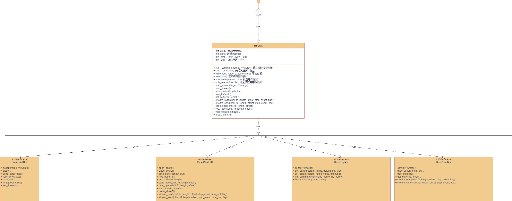
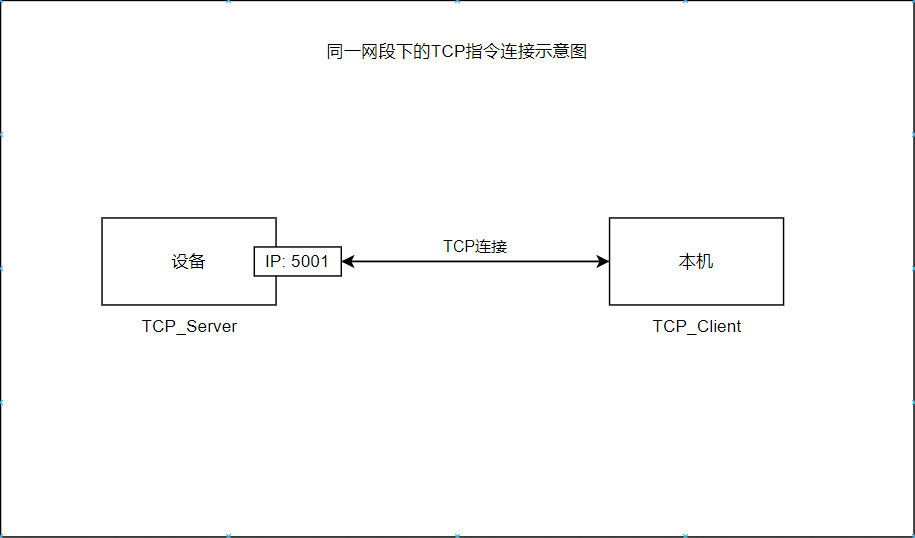
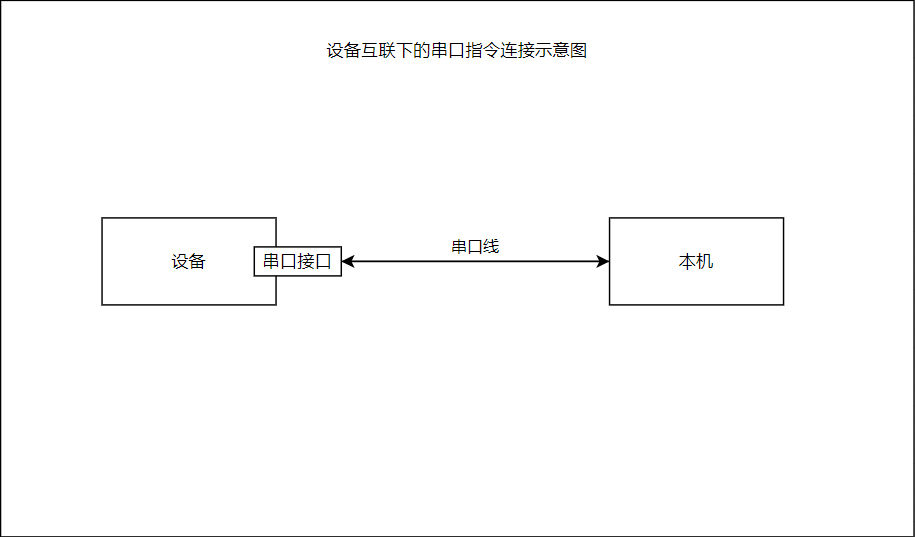
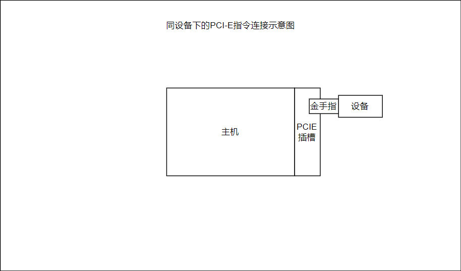
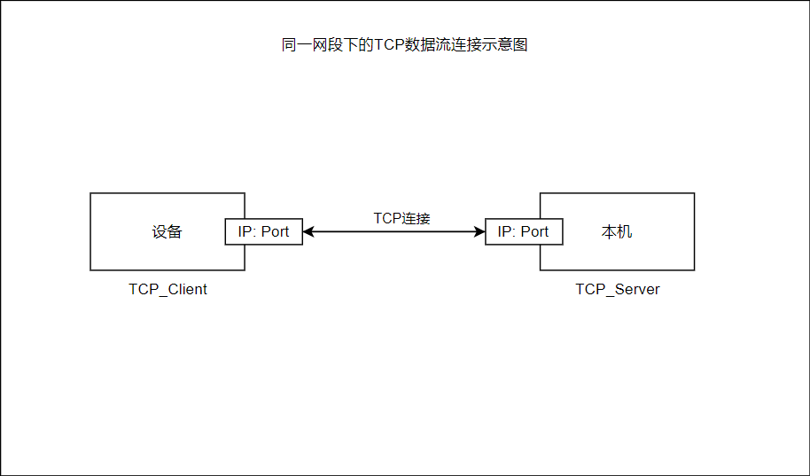
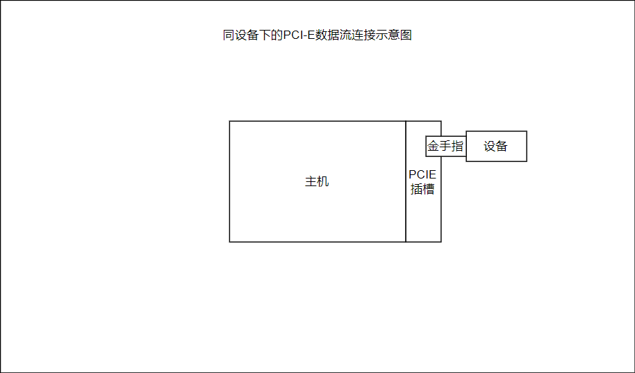

# 快速开始

<div style="position: fixed; top: 90%; left: 90%">
<a href="#目录" style="text-decoration: none">返回目录</a>
</div>


<span id="目录" />

## 目录
* <a href="#工程基本结构">工程基本结构</a>
* <a href="#环境安装">环境安装</a>
* <a href="#网络指令">网络指令</a>
* <a href="#串口指令">串口指令</a>
* <a href="#PCI-E指令">PCI-E指令</a>
* <a href="#网络数据流">网络数据流</a>
* <a href="#PCI-E数据流">PCI-E数据流</a>
* <a href="#名词解释">名词解释</a>
* [进阶使用](Professional.md)

---

<span id="工程基本结构" />

## 工程基本结构
本快速开发工具基本结构如下图所示
<center></center>

---

<span id="环境安装" />

## 环境安装
```shell
    1. conda create -n NSUKit python=3.9
    2. conda activate NSUKit
    3. pip install NSUKit
```

---
## 使用接口

<span id="网络指令" />

### 网络指令
在本工具中，网络指令是指使用TCP/IP通信协议，来实现主机与设备相互通信发送数据的一种方法

<center></center>

_**网络指令代码示例**_
```python
from nsukit import *
nsukit = NSUKit(TCPCmdUItf, TCPChnlUItf)
nsukit.start_command(target="x.x.x.x", port=5001)
nsukit.write(0x1, 4)
nsukit.read(0x1)
nsukit.bulk_write({0x1: 4, 0x2: 8})
nsukit.bulk_read([0x1, 0x2])
```

<span id="串口指令" />

### 串口指令
在本工具中，串口指令是指使用串口线将主机与设备连接，来实现主机与设备相互通信发送数据的一种方法

<center></center>

_**串口指令代码示例**_
```python
from nsukit import *
nsukit = NSUKit(SerialCmdUItf, TCPChnlUItf)
nsukit.start_command(target="COM1", target_baud_rate=9600)
nsukit.write(0x1, 4)
nsukit.read(0x1)
nsukit.bulk_write({0x1: 4, 0x2: 8})
nsukit.bulk_read([0x1, 0x2])
```

<span id="PCI-E指令" />

### PCI-E指令
在本工具中，PCI-E指令是指使用PCI-E总线将主机与设备连接，来实现主机与设备相互通信发送数据的一种方法

<center></center>

_**PCI-E指令代码示例**_
```python
from nsukit import *
nsukit = NSUKit(PCIECmdUItf, PCIEChnlUItf)
nsukit.start_command(target=0, sent_base=0x10000000, recv_base=0x13000000, irq_base=0x00003000 + 44, sent_down_base=0x00003030)
nsukit.write(0x1, 4)
nsukit.read(0x1)
nsukit.bulk_write({0x1: 4, 0x2: 8})
nsukit.bulk_read([0x1, 0x2])
```

<span id="网络数据流" />

### 网络数据流
在本工具中，网络数据流是指使用TCP/IP通信协议，来实现主机与设备相互发送流式数据的一种方法

<center></center>

_**网络数据流代码示例**_
```python
from nsukit import *
import threading
event = threading.Event()
length = 1024
nsukit = NSUKit(TCPCmdUItf, TCPChnlUItf)
nsukit.start_stream(target="x.x.x.x")
fd = nsukit.alloc_buffer(length)
nsukit.stream_recv(99, fd, length, 0, event.is_set)
print(nsukit.get_buffer(fd, length))
```

<span id="PCI-E数据流" />

### PCI-E数据流
在本开发工具中，PCI-E数据流是指使用PCI-E总线将主机与设备连接，来实现主机与设备相互发送流式数据的一种方法

<center></center>

_**PCI-E数据流代码示例**_
```python
from nsukit import *
import threading
event = threading.Event()
length = 1024
nsukit = NSUKit(PCIECmdUItf, PCIEChnlUItf)
nsukit.start_stream(target=0)
fd = nsukit.alloc_buffer(length)
nsukit.stream_recv(0, fd, length, 0, event.is_set)
print(nsukit.get_buffer(fd, length))
```

---

<span id="名词解释" />

##  名词解释

_targrt_ : 目标设备的地址。TCP/IP通信协议中为IP地址，PCI-E中为本机中的设备数量减1，串口为设备串口号

_NSUKit_ : 统一调用工具类

_TCPCmdUItf_ : 网络指令类

_SerialCmdUItf_ : 串口指令类

_PCIECmdUItf_ : PCI-E指令类

_TCPChnlUItf_ : 网络数据流类

_PCIEChnlUItf_ : PCI-E数据流类

---

<center>Copyright © 2023 理工数字系统实验室 <a href="http://naishu.tech/" target="_blank">naishu.tech</a></center>
<center>北京耐数电子有限公司</center>
    